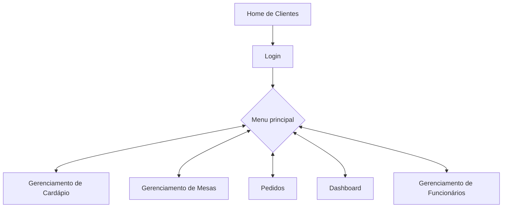
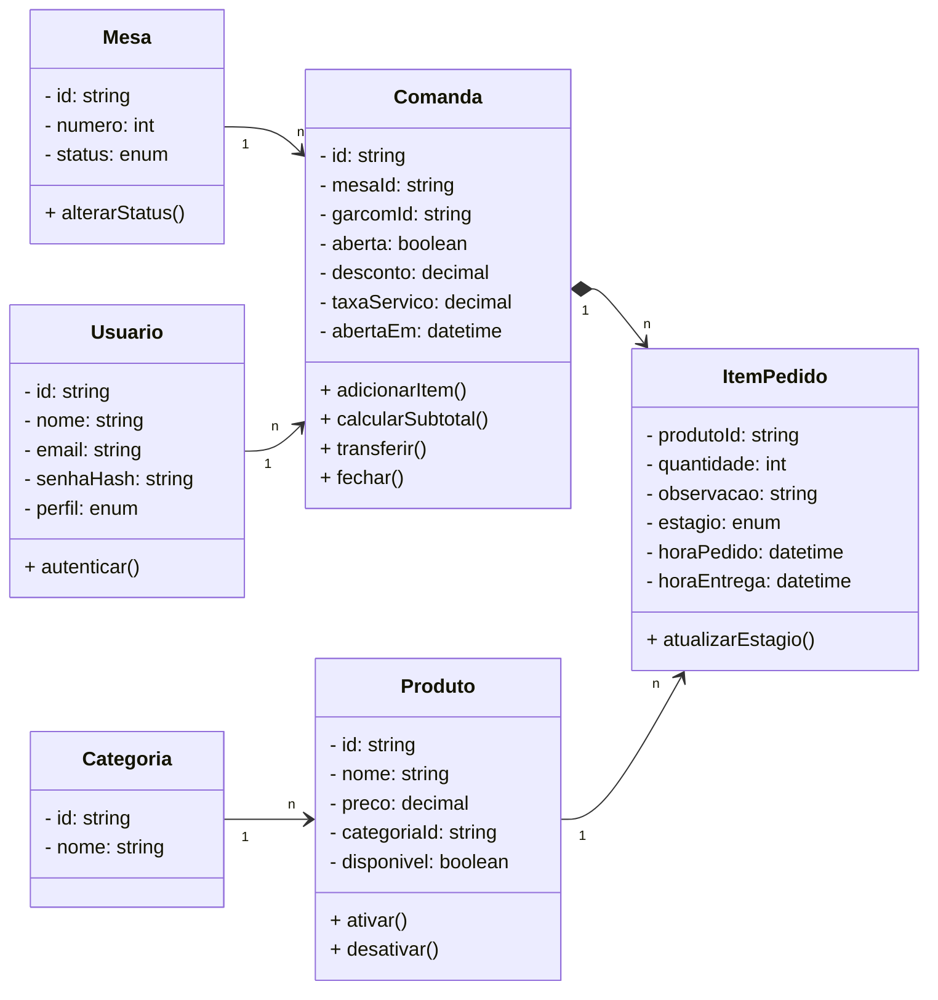
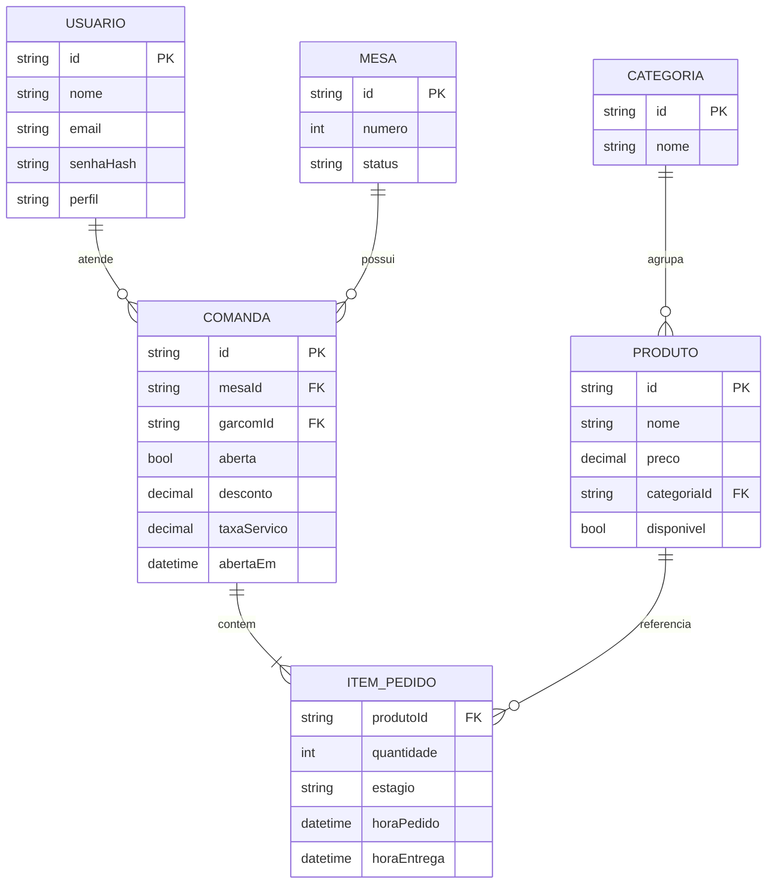

  <picture>
    <source media="(prefers-color-scheme: dark)" srcset="./docs/logo-dark.svg">
    <source media="(prefers-color-scheme: light)" srcset="./docs/logo-light.svg">
    
  </picture>
  
  # ProntaComanda
  ### Centro Paula Souza
  ### Faculdade de Tecnologia de Jahu 
  ### Curso de Tecnologia em Desenvolvimento de Software Multiplataforma
  ### Jaú, SP, BR
  ### Início: 3º Semestre / 2026
  # Documentação da Aplicação Web

# Autores:
<h3 align="center">
   &nbsp;
  <a href="https://www.linkedin.com/in/joaosurita/">João Pedro Surita</a>;
  <a href="https://www.linkedin.com/in/brunoobrunelli/">Bruno Oller Brunelli</a>;
  <a href="https://www.linkedin.com/in/eduardo-petarnella-gabri-18986b353/">Eduardo Petarnella Gabri</a>.
</h3>

<h1>Sumário</h1>

  - [1. Resumo da aplicação web](#1-resumo-da-aplicação-web)
    - [1.1. Objetivos](#11-objetivos)
    - [1.2. Métodos da pesquisa](#12-métodos-da-pesquisa)
  - [2. Plano de negócio do cliente](#2-plano-de-negócio-do-cliente)
    - [2.1. Perfil do cliente](#21-perfil-do-cliente)
    - [2.2. Cenário atual](#22-cenário-atual)
    - [2.3. Dores identificadas](#23-dores-identificadas)
    - [2.4. Objetivos de negócio e de mercado](#24-objetivos-de-negócio-e-de-mercado)
  - [3. Especificação de requisitos](#3-especificação-de-requisitos)
    - [3.1. Requisitos funcionais](#31-requisitos-funcionais)
    - [3.2. Requisitos não funcionais](#32-requisitos-não-funcionais)
    - [3.3. Regras de negócio](#33-regras-de-negócio)
  - [4. Proposta de valor (solução)](#4-proposta-de-valor-solução)
    - [4.1. Como o ProntaComanda resolve cada dor](#41-como-o-prontacomanda-resolve-cada-dor)
    - [4.2. Antes e depois](#42-antes-e-depois)
    - [4.3. Canvas do modelo de negócios](#43-canvas-do-modelo-de-negócios)
  - [5. Estudo de viabilidade](#5-estudo-de-viabilidade)
  - [6. Design](#6-design)
  - [7. Protótipo](#7-protótipo)
  - [8. Aplicação](#8-aplicação)
  - [9. Diagramas da aplicação](#9-diagramas-da-aplicação)
  - [10. Considerações finais](#10-considerações-finais)
  - [Referências bibliográficas](#referências-bibliográficas)

# 1. Resumo da aplicação web
O ProntaComanda é um sistema desenvolvido para otimizar a gestão operacional de estabelecimentos gastronômicos, eliminando gargalos no atendimento e modernizando o controle interno de pedidos. O principal objetivo é centralizar e agilizar o fluxo de trabalho, permitindo que gestores e colaboradores controlem o consumo por mesas e a disponibilidade de itens de forma prática, remota e eficiente.

Através de uma interface intuitiva, o sistema permite o gerenciamento dinâmico de mesas e a atualização em tempo real do cardápio, garantindo que a comunicação entre o salão e a cozinha seja instantânea. Isso reduz erros de anotação e minimiza o tempo de espera dos clientes, elevando o padrão de serviço oferecido.

Além de aprimorar a experiência do consumidor, o ProntaComanda oferece uma visão estratégica para o negócio, possibilitando uma distribuição mais equilibrada das demandas e um controle rigoroso do inventário. Dessa forma, a plataforma promove não apenas agilidade no atendimento, mas também uma maior eficiência administrativa para empreendedores que buscam profissionalizar a gestão de seus estabelecimentos.

## 1.1. Objetivos
### Objetivo geral
Desenvolver uma aplicação web que digitalize e centralize o fluxo de comandas de bares e restaurantes, conectando salão, cozinha e gestão em um único sistema.

### Objetivos específicos
  - Substituir a comanda de papel por um registro digital de consumo por mesa;
  - Enviar os pedidos do salão automaticamente para a cozinha/bar, sem deslocamento do garçom;
  - Manter o cardápio atualizado, ativando ou desativando itens conforme o estoque;
  - Fornecer ao gestor relatórios de faturamento e produtividade para apoiar decisões;
  - Restringir as funções do sistema por perfil de usuário (Admin, Garçom, Cozinheiro).

## 1.2. Métodos da pesquisa
O desenvolvimento deste projeto conta com o apoio da infraestrutura da Fatec de Jahu. As atividades são realizadas tanto durante as aulas quanto em horários livres, utilizando os computadores dos laboratórios da instituição, assim como os dispositivos pessoais dos membros da equipe.

Para a criação da interface e da estrutura da aplicação, estão sendo empregadas as linguagens HTML, CSS e JavaScript, junto com o framework Bootstrap. O protótipo visual está sendo elaborado no Figma, que permite a colaboração entre os integrantes e facilita a definição do design das telas.

O back-end do sistema será implementado em C#, com o banco de dados MongoDB. O código-fonte é editado no Visual Studio e gerenciado por meio do Git, garantindo controle das versões e organização durante todo o processo de desenvolvimento.

<h3 align="center">
   &nbsp;&nbsp;
   &nbsp;&nbsp;
   &nbsp;&nbsp;
   &nbsp;&nbsp;
   &nbsp;&nbsp;
   &nbsp;&nbsp;
  
   &nbsp;&nbsp;
   &nbsp;&nbsp;
  
</h3>

Todo o projeto está sendo desenvolvido nas instalações da Fatec de Jahu, que fornece a infraestrutura e o suporte necessários para a execução das atividades. As tarefas são realizadas ao longo do semestre do curso, integrando-se aos conteúdos das disciplinas, o que permite aplicar de forma prática os conhecimentos adquiridos em sala de aula.

[Voltar para o início](#inicio)

# 2. Plano de negócio do cliente
Esta seção descreve o cliente para o qual o ProntaComanda foi pensado, o cenário em que ele opera hoje, os problemas que enfrenta e o que deseja alcançar. É a base que justifica cada requisito e cada decisão de projeto apresentados nas seções seguintes.

## 2.1. Perfil do cliente
O cliente-alvo é o **pequeno e médio estabelecimento gastronômico** com atendimento em mesas: restaurantes, bares e pubs, lanchonetes e cafeterias, e food trucks com atendimento local. Em geral, são negócios administrados diretamente pelo proprietário, com equipe enxuta (gestor, garçons e cozinha/bar) e pouco investimento em tecnologia.

## 2.2. Cenário atual
Nesse tipo de negócio, o fluxo de atendimento costuma ser majoritariamente manual:

  1. O garçom anota o pedido em uma comanda de papel;
  2. Leva o pedido até a cozinha ou o bar, ou o repassa verbalmente;
  3. A cozinha prepara sem visibilidade do que está pendente ou atrasado;
  4. No fechamento, a conta é somada à mão a partir das anotações;
  5. O cardápio e o estoque são controlados de memória ou em planilhas soltas;
  6. O gestor só tem noção do faturamento ao final do dia ou do mês, sem indicadores de produtividade.

Os sistemas de gestão (ERP) existentes no mercado costumam ser complexos e caros para esse porte de negócio, o que leva muitos empreendedores a permanecerem no processo manual.

## 2.3. Dores identificadas

| ID | Dor | Consequência para o negócio |
|:--:|-----|-----------------------------|
| D1 | Erros de anotação e de interpretação de pedidos manuais | Retrabalho, desperdício de insumos e clientes insatisfeitos |
| D2 | Comunicação lenta ou falha entre salão e cozinha | Pratos atrasados, mesas esperando, baixo giro de mesas |
| D3 | Cardápio desatualizado (item oferecido, mas em falta) | Frustração do cliente e retrabalho do garçom |
| D4 | Falta de visão sobre a ocupação das mesas | Dificuldade de organizar reservas e distribuir o atendimento |
| D5 | Fechamento de conta manual, sujeito a erros de soma e cobrança | Perda de receita ou cobrança indevida |
| D6 | Ausência de dados para gestão (faturamento, itens mais vendidos, tempo de preparo) | Decisões tomadas por intuição |
| D7 | Qualquer funcionário pode mexer em qualquer informação | Falta de controle e risco de fraude ou erro |

## 2.4. Objetivos de negócio e de mercado
  - **Reduzir erros de pedido** e retrabalho no atendimento;
  - **Reduzir o tempo de espera** do cliente, melhorando a experiência e o giro de mesas;
  - **Dar previsibilidade e controle** ao gestor sobre consumo, cardápio e faturamento;
  - **Profissionalizar a gestão** com uma ferramenta simples e de baixo custo, sem a complexidade de um ERP;
  - **Acompanhar a transformação digital** do setor de Food Service, tornando-se acessível a micro e pequenos empreendedores.

[Voltar para o início](#inicio)

# 3. Especificação de requisitos
Um documento de requisitos de sistema descreve o que o sistema deve fazer, suas funções, regras e limitações. Ele serve como guia para o desenvolvimento, ajudando a garantir que o sistema atenda às necessidades dos usuários e funcione corretamente.

Os requisitos são divididos em dois grupos:

| | Requisitos Funcionais (RF) | Requisitos Não Funcionais (RNF) |
|---|---|---|
| **O que definem** | O que o sistema **faz**: funcionalidades e comportamentos | **Como** o sistema deve ser: qualidade, restrições e padrões |
| **Exemplo neste projeto** | RF6: adicionar produtos à comanda de uma mesa | RNF1: responder às ações do usuário em até 2 segundos |
| **Como verificar** | O usuário consegue (ou não) executar a função | Medição de desempenho, segurança, usabilidade etc. |

**Prioridade:** *Alta* = essencial para o sistema funcionar (MVP); *Média* = importante, mas pode ser entregue em uma segunda etapa.

## 3.1. Requisitos funcionais

### Módulo: Cardápio
| ID | Requisito | Descrição | Prioridade | Dor |
|:--:|-----------|-----------|:----------:|:---:|
| RF1 | Cadastro de Produtos | O sistema deve permitir a inclusão, alteração e exclusão de itens (nome, preço, categoria). | Alta | D3 |
| RF2 | Controle de Disponibilidade | O sistema deve ativar ou desativar itens do cardápio conforme o estoque. | Alta | D3 |
| RF3 | Categorização de Itens | O sistema deve permitir agrupar produtos para facilitar a navegação (ex: Entradas, Bebidas). | Alta | D3 |

### Módulo: Mesas e comandas
| ID | Requisito | Descrição | Prioridade | Dor |
|:--:|-----------|-----------|:----------:|:---:|
| RF4 | Monitoramento de Status | O sistema deve exibir em tempo real se a mesa está livre, ocupada ou reservada. | Alta | D4 |
| RF5 | Abertura de Comanda | O sistema deve vincular o início de um atendimento a uma numeração de mesa específica. | Alta | D1, D4 |
| RF6 | Lançamento de Consumo | O sistema deve permitir adicionar produtos à conta ativa de uma mesa. | Alta | D1 |
| RF7 | Remanejamento de Mesa | O sistema deve permitir transferir pedidos ou unir contas de mesas diferentes. | Média | D4 |

### Módulo: Cozinha e bar
| ID | Requisito | Descrição | Prioridade | Dor |
|:--:|-----------|-----------|:----------:|:---:|
| RF8 | Transmissão de Pedidos | O sistema deve enviar automaticamente as solicitações do salão para a produção (Cozinha/Bar). | Alta | D2 |
| RF9 | Gestão de Preparo | O sistema deve atualizar o estágio do prato (Pendente, Em Preparo, Finalizado). | Alta | D2 |
| RF10 | Log de Tempo | O sistema deve registrar o tempo decorrido entre o pedido e a entrega. | Média | D2, D6 |

### Módulo: Fechamento de conta
| ID | Requisito | Descrição | Prioridade | Dor |
|:--:|-----------|-----------|:----------:|:---:|
| RF11 | Cálculo de Subtotal | O sistema deve somar automaticamente todos os itens consumidos na comanda. | Alta | D5 |
| RF12 | Ajuste de Valores | O sistema deve permitir aplicar descontos, cortesias ou taxas de serviço no total da conta. | Média | D5 |

### Módulo: Gestão e segurança
| ID | Requisito | Descrição | Prioridade | Dor |
|:--:|-----------|-----------|:----------:|:---:|
| RF13 | Controle de Acesso | O sistema deve permitir restringir funções por nível de usuário (Admin, Garçom, Cozinheiro). | Alta | D7 |
| RF14 | Relatório de Vendas | O sistema deve permitir gerar demonstrativos de faturamento e produtividade por período. | Média | D6 |

## 3.2. Requisitos não funcionais

| ID | Categoria | Descrição | Como verificar |
|:--:|-----------|-----------|----------------|
| RNF1 | Desempenho | O sistema deve responder às ações do usuário (abrir mesa, lançar item, consultar cardápio) em até 2 segundos em condições normais de uso, e refletir novos pedidos na tela da cozinha em poucos segundos. | Teste de tempo de resposta |
| RNF2 | Usabilidade | A interface deve ser intuitiva e adaptável a diferentes tamanhos de tela, como computadores, tablets e celulares, permitindo que um novo funcionário execute as tarefas básicas com pouco treinamento. | Teste com usuários |
| RNF3 | Portabilidade | O sistema deve funcionar corretamente nos principais navegadores de internet e dispositivos móveis. | Teste em navegadores e dispositivos |
| RNF4 | Manutenibilidade | O sistema deve ser de fácil manutenção, com documentação clara e organizada e arquitetura em padrão MVC, permitindo futuras atualizações e correções. | Revisão de código e documentação |
| RNF5 | Suporte | Deve ser disponibilizado suporte técnico para solucionar eventuais problemas no funcionamento da aplicação. | Canal de suporte definido |
| RNF6 | Segurança | O sistema deve proteger as informações dos usuários, com autenticação, senhas armazenadas de forma criptografada e acesso às funções conforme o perfil, assegurando privacidade e integridade dos dados. | Teste de autenticação e permissões |
| RNF7 | Disponibilidade | O sistema deve estar disponível para uso durante o horário de funcionamento do estabelecimento, com interrupções mínimas e programadas fora do horário de pico. | Monitoramento de disponibilidade |
| RNF8 | Controle de versão | O desenvolvimento será acompanhado de boas práticas de versionamento (Git/GitHub) para facilitar a gestão e a rastreabilidade das mudanças. | Histórico de commits |
| RNF9 | Acessibilidade | O sistema deve respeitar padrões de acessibilidade (contraste adequado, textos legíveis, navegação por teclado) para garantir o uso por pessoas com diferentes necessidades. | Checklist de acessibilidade |
| RNF10 | Tolerância a falhas | O sistema deve garantir que os dados não sejam perdidos em caso de falhas, mantendo cópias de segurança do banco de dados. | Teste de restauração de backup |
| RNF11 | Interoperabilidade | O sistema deve permitir a exportação dos dados de vendas em formatos comuns (como CSV ou PDF), para uso em outras soluções administrativas, como controle financeiro e contabilidade. | Teste de exportação |

## 3.3. Regras de negócio
As regras de negócio (RN) são as políticas do estabelecimento que o sistema deve respeitar.

| ID | Regra |
|:--:|-------|
| RN1 | Uma comanda só pode ser aberta para uma mesa com status **livre** ou **reservada**. |
| RN2 | Cada mesa possui no máximo uma comanda aberta por vez. |
| RN3 | Itens desativados no cardápio não podem ser lançados em novas comandas. |
| RN4 | Todo item lançado gera um pedido para a cozinha ou o bar, conforme sua categoria. |
| RN5 | O estágio de um pedido segue a ordem: Pendente, Em Preparo, Finalizado. |
| RN6 | Somente o perfil **Admin** pode alterar o cardápio, aplicar descontos/cortesias e acessar relatórios. |
| RN7 | O perfil **Garçom** pode abrir comandas, lançar itens e fechar contas; o perfil **Cozinheiro** só atualiza o estágio dos pedidos. |
| RN8 | Ao fechar a conta, a mesa volta ao status **livre**. |

[Voltar para o início](#inicio)

# 4. Proposta de valor (solução)
O ProntaComanda entrega ao pequeno estabelecimento gastronômico uma forma **simples, acessível e integrada** de controlar o atendimento, do pedido à conta, no lugar do papel e da comunicação verbal.

> **Proposta de valor:** facilitar o gerenciamento de estabelecimentos gastronômicos e eliminar os erros de pedidos manuais, conectando salão, cozinha e gestão em tempo real.

## 4.1. Como o ProntaComanda resolve cada dor

| Dor do cliente | Como o sistema resolve | Requisitos | Benefício esperado |
|----------------|------------------------|:----------:|--------------------|
| **D1** Erros de anotação | O garçom seleciona os itens no sistema em vez de escrever à mão; o pedido chega à cozinha exatamente como foi lançado. | RF5, RF6 | Menos erros e retrabalho |
| **D2** Comunicação lenta salão-cozinha | O pedido é enviado automaticamente à cozinha/bar, que atualiza o estágio do preparo, com tempo registrado. | RF8, RF9, RF10 | Menor tempo de espera e melhor giro de mesas |
| **D3** Cardápio desatualizado | O gestor ativa ou desativa itens conforme o estoque, e a mudança vale imediatamente para todos. | RF1, RF2, RF3 | Cliente não pede o que não existe |
| **D4** Falta de visão das mesas | Painel em tempo real com mesas livres, ocupadas e reservadas, com transferência e união de contas. | RF4, RF7 | Atendimento mais organizado |
| **D5** Fechamento manual | O total é somado automaticamente, com opção de desconto, cortesia e taxa de serviço. | RF11, RF12 | Contas corretas e sem perda de receita |
| **D6** Falta de dados | Relatórios de faturamento e produtividade por período. | RF10, RF14 | Decisões baseadas em dados |
| **D7** Falta de controle de acesso | Cada funcionário acessa apenas as funções do seu perfil. | RF13 | Mais segurança e responsabilização |

## 4.2. Antes e depois

| Situação | Sem o ProntaComanda | Com o ProntaComanda |
|----------|---------------------|---------------------|
| Registro do pedido | Papel, escrita à mão | Lançamento digital por mesa |
| Envio à cozinha | Garçom leva ou repassa verbalmente | Automático e instantâneo |
| Acompanhamento do preparo | Sem visibilidade | Estágios Pendente, Em Preparo e Finalizado |
| Atualização do cardápio | Aviso verbal | Ativação/desativação centralizada |
| Fechamento da conta | Soma manual | Cálculo automático com ajustes |
| Visão gerencial | Só no fim do período, por estimativa | Relatórios por período |

## 4.3. Canvas do modelo de negócios
### Figura 1 - Canvas, modelo de negócios:

  

**O que será elaborado? (Proposta de valor)**
  - Facilitar o gerenciamento de estabelecimentos gastronômicos;
  - Eliminar erros de pedidos manuais.

**Como será elaborado?**
  - *Parcerias principais:* provedores de hospedagem e estabelecimentos gastronômicos;
  - *Atividades principais:* desenvolvimento e manutenção do software; atualização de funcionalidades do cardápio;
  - *Recursos principais:* equipe de desenvolvimento, internet, plataforma de hospedagem, conteúdo e informações.

**Para quem será elaborado?**
  - *Segmento de mercado:* pequenos e médios restaurantes; bares e pubs; lanchonetes e cafeterias; food trucks com atendimento local;
  - *Relacionamento com o cliente:* autoatendimento (interface intuitiva) e feedback contínuo para melhorias;
  - *Canais:* website, redes sociais e parcerias locais.

**Quanto custará?**
  - *Estrutura de custos:* domínio da aplicação; desenvolvimento e manutenção; hospedagem; suporte ao cliente;
  - *Fontes de renda:* devido ao caráter educacional e acadêmico, não estamos considerando fontes de receita.

[Voltar para o início](#inicio)

# 5. Estudo de viabilidade
### Viabilidade técnica: 
O sistema é tecnicamente viável, pois é desenvolvido com tecnologias modernas, robustas e consolidadas no mercado. O front-end utiliza React e Tailwind CSS para uma interface ágil e responsiva, enquanto o back-end é estruturado em Node.js com Express, garantindo alto desempenho, facilidade de manutenção e escalabilidade. A comunicação em tempo real entre salão e cozinha é viabilizada via Socket.io (WebSockets). A persistência de dados utiliza o MongoDB com Mongoose, proporcionando um gerenciamento de dados flexível, seguro e performático. O uso do VS Code, aliado ao Git e GitHub para versionamento, garante o suporte ideal ao trabalho colaborativo da equipe.

### Viabilidade financeira: 
O projeto demonstra alta viabilidade financeira, visto que se baseia na utilização de ferramentas de código aberto (open-source), eliminando custos elevados com licenças de software. O investimento inicial é reduzido, concentrando-se principalmente na hospedagem e manutenção básica. Ao aproveitar a infraestrutura acadêmica e tecnologias gratuitas, o ProntaComanda se posiciona como uma solução de baixo custo operacional e alta sustentabilidade econômica para micro e pequenos estabelecimentos.

### Viabilidade de mercado: 
O ProntaComanda possui forte viabilidade de mercado, inserindo-se na crescente demanda por transformação digital no setor de Food Service. Com a necessidade constante de bares e restaurantes em reduzir erros de pedido e aumentar o giro de mesas, uma ferramenta que simplifica a gestão do cardápio e o atendimento torna-se altamente competitiva. A solução atende diretamente empreendedores que buscam profissionalizar o serviço sem o alto investimento de softwares de gestão (ERP) complexos.

### Viabilidade operacional: 
O sistema é operacionalmente viável, priorizando uma interface limpa e intuitiva que se adapta à rotina acelerada de garçons e gestores. A curva de aprendizado é mínima, permitindo que a equipe comece a operar o gerenciamento de mesas e pedidos com agilidade, sem interromper o fluxo de trabalho atual. A centralização das informações reduz a falha de comunicação entre o salão e a cozinha, otimizando o tempo de entrega e elevando a qualidade do atendimento final.

[Voltar para o início](#inicio)

# 6. Design
### Paleta de cores:

### Paleta de Cores

#### Modo Light
| Nome | Hexadecimal | Cor |
|---|:---:|:---:|
| Black | `#000000` |  |
| Dark Graphite | `#161616` |  |
| Off Black | `#1A1A1A` |  |
| White | `#FFFFFF` |  |
| Orange | `#EE4400` |  |
| Red | `#D00000` |  |

---

#### Modo Dark
| Nome | Hexadecimal | Cor |
|---|:---:|:---:|
| White | `#FFFFFF` |  |
| Soft White | `#F4F4F4` |  |
| Off White | `#EFEFEF` |  |
| Black | `#000000` |  |
| Orange | `#EE4400` |  |
| Red | `#D00000` |  |

### Tipografia: 
- [Archivo (Títulos) - Google Fonts](https://fonts.google.com/specimen/Archivo)
- [Rubik - Google Fonts](https://fonts.google.com/specimen/Rubik)

### Modelo de navegação:
Após o login, o usuário acessa o menu principal, de onde pode navegar livremente entre os módulos permitidos pelo seu perfil (RF13).

[Voltar para o início](#inicio)

# 7. Protótipo
- ### Link do protótipo com a ferramenta Figma: [Figma - ProntaComanda](https://www.figma.com/proto/DiucbOuIzhfo5k8jNEIjij/ProntaComanda?node-id=0-1&t=46LvV2O62RCQsEJs-1)

- ### Figura 2 - Protótipo da página principal Home:

  

- ### Figura 3 - Protótipo da tela de perfil do usuário:

  

[Voltar para o início](#inicio)

# 8. Aplicação
- ### Link para o nosso repositório do GitHub: [Repositório - ProntaComanda](https://github.com/BrunoOller/ProntaComanda)
  
- ### Figura 4 - Página Home:

  

- ### Figura 5 - Página Perfil do Usuário:

  

[Voltar para o início](#inicio)

# 9. Diagramas da aplicação
Os diagramas da aplicação representam de forma visual a estrutura e o funcionamento do sistema, auxiliando na compreensão e no planejamento do projeto. Por meio da notação UML, é possível visualizar as principais interações, classes e entidades do banco de dados, facilitando o entendimento entre todos os envolvidos no desenvolvimento.

## 9.1. Diagrama de Casos de Uso
Mostra como os usuários interagem com o sistema e quais são as principais funcionalidades disponíveis. Ajuda a identificar os papéis dos atores e os fluxos de uso da aplicação.
- ### Figura 6:

  

## 9.2. Diagrama de Classes
Apresenta a estrutura interna do sistema, mostrando as classes, seus atributos, métodos e relacionamentos. Permite compreender a organização do código e a relação entre os componentes.

> Observação: como o banco é orientado a documentos (MongoDB), os itens do pedido ficam embutidos dentro do documento da comanda (relação de composição).

## 9.3. Diagrama de Banco de Dados
Representa as coleções e os relacionamentos que compõem a base de dados do sistema. Serve para planejar e documentar a forma como as informações serão armazenadas e conectadas.

[Voltar para o início](#inicio)

# 10. Considerações finais

A aplicação **ProntaComanda** foi concebida com o objetivo de modernizar e agilizar a gestão de atendimento em estabelecimentos gastronômicos, oferecendo uma solução robusta e integrada para o controlo de mesas, cardápios e esteira de preparação em tempo real (KDS). Ao utilizar uma arquitetura desacoplada com **React** e **Tailwind CSS** no front-end, aliada a **Node.js** e **Express** no back-end com comunicação via **Socket.io**, o projeto elimina as limitações de sistemas tradicionais baseados em papel ou atualizações manuais de página, permitindo o fluxo de dados instantâneo entre o salão e a cozinha.

A adoção do banco de dados NoSQL **MongoDB** (com Mongoose) viabilizou uma persistência de dados orientada a documentos altamente performática e flexível. Isso permitiu tratar adequadamente estruturas complexas do setor de *Food Service*, tais como itens do cardápio com categorias personalizadas, histórico de comandas e auditoria de estornos. O desenvolvimento desse ecossistema proporcionou desafios práticos enriquecedores em engenharia de software, englobando desde o controlo de acesso baseado em funções (RBAC) e segurança de autenticação até a sincronização de eventos em tempo real.

Em suma, o ProntaComanda cumpre o seu propósito ao eliminar falhas de comunicação, reduzir o tempo de espera dos clientes e otimizar a eficiência operacional no setor gastronómico. O projeto não apenas entrega uma ferramenta funcional e escalável para o mercado, mas também consolida o aprendizado prático da equipa no desenvolvimento de aplicações web modernas, arquitetura de microserviços/APIs RESTful e integração com bancos de dados não relacionais.

[Voltar para o início](#inicio)

---

# Referências bibliográficas

EXPRESS. Express - Framework web rápido, flexível e minimalista para Node.js. 2026. Disponível em: <https://expressjs.com/>. Acesso em: 28 set. 2026.

FIGMA, Inc. Figma: the collaborative interface design tool. 2026. Disponível em: <https://www.figma.com/>. Acesso em: 28 set. 2026.

MIND THE GRAPH. O que é um estudo de viabilidade em pesquisa? 2023. Disponível em: <https://mindthegraph.com/blog/pt/o-que-e-um-estudo-de-viabilidade-em-pesquisa/>. Acesso em: 28 set. 2026.

MONGODB, Inc. MongoDB: The Application Data Platform. 2026. Disponível em: <https://www.mongodb.com/>. Acesso em: 28 set. 2026.

NODE.JS FOUNDATION. Node.js v20 LTS Documentation. 2026. Disponível em: <https://nodejs.org/>. Acesso em: 28 set. 2026.

REACT. React – Uma biblioteca JavaScript para criar interfaces de usuário. 2026. Disponível em: <https://react.dev/>. Acesso em: 28 set. 2026.

SOCKET.IO. Socket.IO: Bidirectional and low-latency communication for every platform. 2026. Disponível em: <https://socket.io/>. Acesso em: 28 set. 2026.

TAILWIND LABS INC. Tailwind CSS - Rapidly build modern websites without ever leaving your HTML. 2026. Disponível em: <https://tailwindcss.com/>. Acesso em: 28 set. 2026.

TRELLO. Trello: Organize anything with anyone, anywhere. 2026. Disponível em: <https://trello.com/>. Acesso em: 28 set. 2026.

[Voltar para o início](#inicio)
